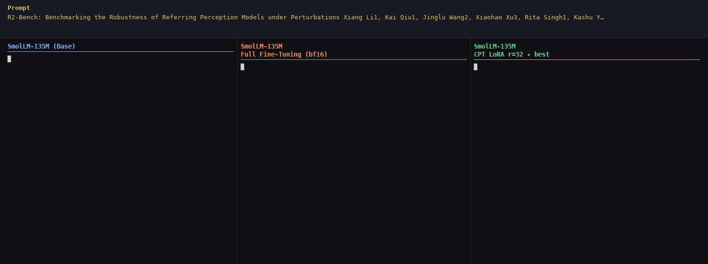

---
language:
- en
license: apache-2.0
base_model: HuggingFaceTB/SmolLM-135M
tags:
- continued-pretraining
- lora
- unsloth
- scientific
- arxiv
- nlp
datasets:
- JaydeepR/arxiv-ml-papers-cpt
---

# SmolLM-135M-CPT-LoRA-r32

Continued pre-training of [SmolLM-135M](https://huggingface.co/HuggingFaceTB/SmolLM-135M) on arXiv ML papers via LoRA (r=32).



*Side-by-side generation: Base model vs Full Fine-Tuning (bf16) vs this model (CPT LoRA r=32)*

## Model Description

- **Base model:** HuggingFaceTB/SmolLM-135M (135M parameters)
- **Method:** Continued Pre-Training (CPT) with LoRA
- **Domain:** Machine Learning / arXiv papers (2024–2026)
- **Task:** Next-token prediction / scientific text generation

## Training Details

| Parameter | Value |
|---|---|
| LoRA rank | 32 |
| LoRA alpha | 32 |
| Target modules | q_proj, k_proj, v_proj, o_proj, gate_proj, up_proj, down_proj |
| Trainable params | ~9.7M / 135M (6.77%) |
| Quantization | 4-bit (QLoRA via Unsloth) |
| Batch size | 32 |
| Gradient accumulation | 2 (effective batch: 64) |
| Learning rate | 2e-4 (linear decay) |
| Warmup steps | 100 |
| Epochs | 10 |
| Sequence length | 512 tokens |
| Chunking | 256-word chunks, 20% overlap, packed |
| Hardware | NVIDIA RTX 4090 |
| Training time | ~14 min |

## Training Data

- **188 arXiv ML papers** (2024–2026), downloaded via the arXiv API
- Papers cleaned: references section removed, appendix preserved
- Split: 138 train / 50 validation
- After chunking + packing: ~5,200 training sequences

## Evaluation Results

Evaluated on 50 held-out papers, 50 samples, 20-word prefix → 50-word generation:

| Metric | Base Model | This Model | Δ |
|---|---|---|---|
| Perplexity | 22.97 | **18.36** | -20.1% |
| Cross-Entropy | 3.134 | **2.910** | -7.1% |
| ROUGE-1 | 0.178 | **0.213** | +19.7% |
| ROUGE-L | 0.114 | **0.143** | +25.4% |
| BERTScore F1 | 0.736 | **0.753** | +2.3% |
| BLEU | 0.016 | **0.022** | +37.5% |

## Key Findings from Experiment Loop

This model was selected as the winner from a systematic experiment loop:

1. **LoRA beats full fine-tuning on small datasets** — 138 papers is too few for full FT; LoRA's regularisation helps
2. **Rank doesn't matter much** — r=8/16/32 all plateau at the same eval loss; data is the bottleneck
3. **Interleaving with large HF datasets didn't help** at this data scale — domain signal gets diluted

## How to Use

```python
from transformers import AutoModelForCausalLM, AutoTokenizer
from peft import PeftModel

base_model_id = "HuggingFaceTB/SmolLM-135M"
adapter_id = "JaydeepR/SmolLM-135M-CPT-LoRA-r32"

tokenizer = AutoTokenizer.from_pretrained(base_model_id)
model = AutoModelForCausalLM.from_pretrained(base_model_id)
model = PeftModel.from_pretrained(model, adapter_id)

prompt = "We propose a novel attention mechanism that"
inputs = tokenizer(prompt, return_tensors="pt")
outputs = model.generate(**inputs, max_new_tokens=100, repetition_penalty=1.2)
print(tokenizer.decode(outputs[0], skip_special_tokens=True))
```

## Limitations

- Trained on only 188 papers — sufficient for stylistic adaptation, not factual knowledge
- May hallucinate scientific content (model learns paper structure, not paper facts)
- Optimised for ML paper generation; may not generalise to other scientific domains
- 135M parameter model — limited overall capability

## Citation

```
@misc{smollm135m-cpt-lora,
  author = {Jaydeep Raijada},
  title  = {SmolLM-135M CPT LoRA r=32 — Continued Pre-Training on arXiv ML Papers},
  year   = {2026},
  url    = {https://huggingface.co/JaydeepR/SmolLM-135M-CPT-LoRA-r32}
}
```
